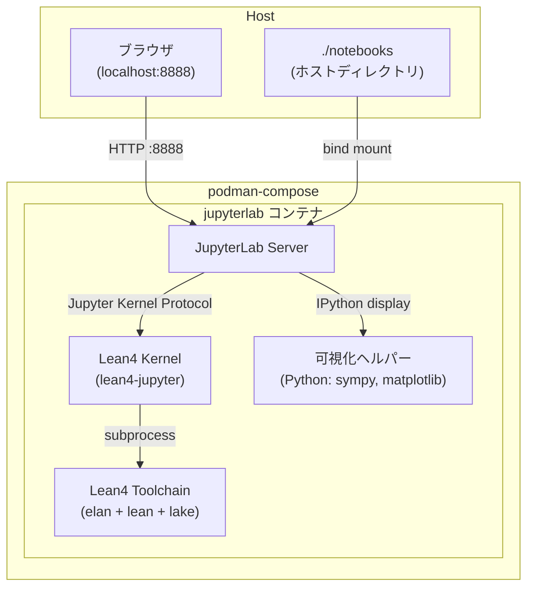

# Design Document

## Overview

JupyterLab + Lean4をpodman compose上で動かす環境を構築する。コアとなるJupyterLabコンテナにLean4ツールチェーンとJupyter用Lean4カーネルをインストールし、数式可視化は同一コンテナ内のPythonライブラリ（SymPy + MathJax）で実現する。

構成はシンプルさを優先し、単一コンテナ構成をベースとしつつ、将来的な拡張のためにcomposeファイルで複数サービスに分割できる設計とする。

## Architecture



シングルコンテナ構成を採用する理由：
- Lean4カーネルとJupyterLabが同一プロセス空間にある方がカーネル管理が単純
- 可視化はJupyterLabのIPython display機構で十分実現可能
- podman composeのネットワーク設定の複雑さを避けられる

## Components and Interfaces

### 1. Dockerfile (`docker/Dockerfile`)

ベースイメージ: `ubuntu:22.04`

インストール手順:
1. システム依存パッケージ（curl, git, python3, pip等）
2. elan（Lean4バージョンマネージャ）→ lean4 + lake
3. lean4-jupyter（Lean4用Jupyterカーネル）
4. JupyterLab本体
5. 可視化用Pythonパッケージ（sympy, matplotlib, ipywidgets）

```
/root/.elan/          # elan + lean4 toolchain
/usr/local/lib/       # Python packages (jupyterlab, lean4-jupyter, sympy)
/home/jovyan/         # 作業ディレクトリ（ボリュームマウント先）
```

### 2. podman-compose.yml

```yaml
services:
  jupyterlab:
    build: ./docker
    ports:
      - "8888:8888"
    volumes:
      - ./notebooks:/home/jovyan/work
    environment:
      - JUPYTER_TOKEN=lean4dev
    command: >
      jupyter lab --ip=0.0.0.0 --port=8888
        --no-browser --allow-root
        --NotebookApp.token=${JUPYTER_TOKEN}
```

### 3. Lean4 Kernel

[lean4-jupyter](https://github.com/utensil/lean4-jupyter) を使用する。これはJupyterのカーネルプロトコルを実装したLean4カーネルで、`pip install lean4-jupyter` でインストール可能。

カーネル登録:
```bash
python -m lean4_jupyter.install
```

セル実行フロー:
1. ユーザーがセルを実行
2. JupyterLabがLean4カーネルにコードを送信
3. カーネルがleanプロセスをサブプロセスとして起動
4. 結果（型情報、エラー等）をJupyterLabに返却

### 4. 可視化ヘルパー (`notebooks/lean4_viz.py`)

notebookから`import lean4_viz`して使うPythonモジュール。

```python
# 使用例（notebook内）
import lean4_viz
lean4_viz.show_latex(r"\forall x \in \mathbb{N}, x + 0 = x")
lean4_viz.show_expr("Nat.add_zero")  # Lean4の型シグネチャをLaTeXで表示
```

内部実装:
- `IPython.display.Math` を使ってMathJax経由でLaTeXをレンダリング
- JupyterLabはデフォルトでMathJaxを内蔵しているため追加設定不要

### 5. サンプルNotebook (`notebooks/lean4_intro.ipynb`)

以下のセクションを含む:
- Lean4の基本的な型と式
- 簡単な定理の証明
- `#check`, `#eval` コマンドの使用例
- 可視化ヘルパーを使った数式表示

## Data Models

### ボリューム構造

```
./notebooks/              # ホスト側（git管理対象）
  lean4_intro.ipynb       # サンプルnotebook
  lean4_viz.py            # 可視化ヘルパーモジュール
```

### コンテナ内パス

```
/home/jovyan/work/        # ボリュームマウント先
  lean4_intro.ipynb
  lean4_viz.py
/root/.elan/bin/          # lean, lake, elan コマンド
```

## Error Handling

| シナリオ | 対応 |
|---|---|
| Lean4カーネルが起動しない | コンテナログにエラー出力、JupyterLabのカーネル選択画面でエラー表示 |
| Lean4コードの構文エラー | カーネルがエラーメッセージをセル出力に返す（Lean4標準エラー形式） |
| 可視化ヘルパーのLaTeX不正 | MathJaxがエラー表示、`show_latex`はtry/exceptでフォールバックテキスト表示 |
| ボリュームマウント失敗 | podman composeがエラーで起動失敗、ホスト側ディレクトリを自動作成するよう設定 |

## Testing Strategy

### ビルド検証
- `podman compose build` が成功すること
- `podman compose up` 後にJupyterLabが`:8888`で応答すること

### カーネル動作検証
- サンプルnotebookの全セルを実行してエラーなく完了すること
- `#eval 1 + 1` が `2` を返すこと
- `#check Nat.add_zero` が型シグネチャを返すこと

### 可視化検証
- `lean4_viz.show_latex(r"\alpha + \beta")` がMathJaxでレンダリングされること
- 不正なLaTeX入力でフォールバックテキストが表示されること
